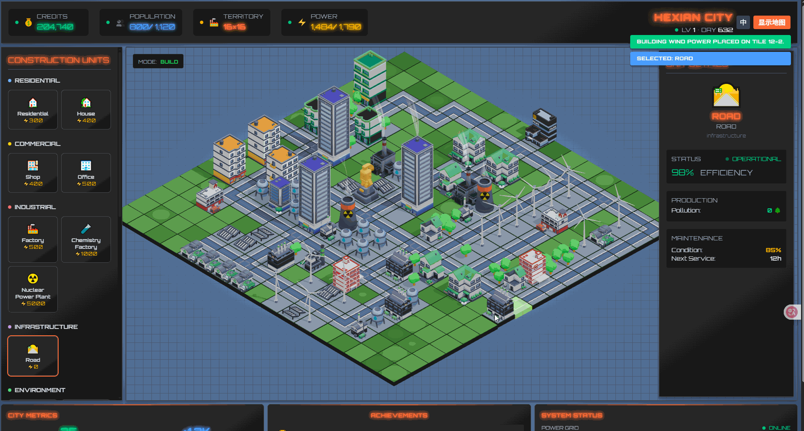

# 🚀 CubeCity: 现代 3D 城市建造模拟系统

<a href="https://hellogithub.com/repository/hexianWeb/CubeCity" target="_blank"></a>

[English README](./README.en.md) | [新手指南](./docs/新手指南.md) | [开发手册](./docs/新手开发指南.md)

**CubeCity** 是一款基于 **Three.js** 与 **Vue 3** 开发的轻量级、响应式 3D 城市建造模拟游戏。它不仅是一个前端 3D 视觉演示项目，更是一个具备完整经济闭环、深度交互逻辑与存档管理系统的微型游戏引擎。



---

## ✨ 核心特性 (Secondary Dev Edition)

### 🏗️ 极致建设体验
*   **全屏画布交互**：采用全屏沉浸式布局，UI 悬浮于场景之上，支持 WASD 平移、QE 视角旋转，操作感媲美专业城建游戏。
*   **建造虚影预览 (Ghosting)**：在放置建筑前，实时预览半透明模型，并根据地形合法性（如是否靠近道路）自动切换红/绿色彩反馈。
*   **交互动画 (GSAP)**：基于 GSAP 实现的“弹性落地”建造效果、“脉冲”升级特效及“平滑缩小”拆除动画，赋予城市生命力。

### 🎮 现代化 HUD 与热键
*   **ModeHUD 悬浮工具栏**：可自由拖拽的中央控制面板，支持双击 Demolish 模式在“安全确认”与“快速强拆”模式间闪电切换。
*   **全键盘支持**：
    *   `1` `2` `3` `4`：快速切换选择、建造、搬迁、拆除模式。
    *   `W` `A` `S` `D`：平滑移动摄像机。
    *   `Q` `E` / `ArrowKeys`：多角度视角切换。
    *   `I`：一键折叠右侧建筑详情面板。

### 📊 城市管理与策略
*   **RCI 经济平衡**：深度模拟住宅 (R)、商业 (C)、工业 (I) 的相互需求。
*   **ESG 评价体系**：通过环境 (E)、社会 (S)、治理 (G) 指标衡量城市健康度。
*   **实时卫星地图**：顶栏地图实时同步城市格局，支持分类着色与当前坐标追踪。

### 💾 档案管理系统
*   **多槽位存档**：内置 3 个本地快速存档位，记录城市名称、等级、金币及精确的时间戳。
*   **JSON 导入导出**：支持将城市数据导出为 JSON 文件分享给好友，或通过导入功能迁移建设进度。

---

## 🎮 玩法介绍

游戏通过四种核心模式，让您掌控城市发展的每一个细节：

*   **🔍 1 - 选择模式 (SELECT)**：查看建筑详情，监控生产效率及维护状态。
*   **🏗️ 2 - 建造模式 (BUILD)**：配合**预览虚影**，规划您的城市版图。注意：大多数建筑需要依路而建。
*   **🚚 3 - 搬迁模式 (RELOCATE)**：选中建筑后点击空地即可平移，支持按 `R` 旋转模型方向。
*   **💥 4 - 拆除模式 (DEMOLISH)**：清理旧区域。建议在顶栏或 HUD 开启“快速模式”进行大规模旧城改造。

---

## 🛠️ 技术栈

| 领域 | 技术方案 |
| :--- | :--- |
| **渲染引擎** | [Three.js](https://threejs.org/) (WebGL) |
| **应用框架** | [Vue 3](https://vuejs.org/) (Composition API) |
| **状态管理** | [Pinia](https://pinia.vuejs.org/) (With PersistedState) |
| **动画驱动** | [GSAP](https://greensock.com/gsap/) |
| **样式 UI** | [Tailwind CSS](https://tailwindcss.com/) & Headless UI |
| **辅助工具** | [mitt](https://github.com/developit/mitt) (EventBus), [Vite](https://vitejs.dev/) |

---

## 🔄 建筑状态系统 (Looping Status)

项目内置了一套复杂的建筑状态反馈机制，通过浮动图标实时展示：

1.  **Debuff 优先逻辑**：电力不足、断路、人口过载等负面状态会优先轮循显示。
2.  **Buff 增益显示**：当基础需求满足时，显示产出加成、升级可用等增益提示。
3.  **视觉平滑**：所有状态切换均带有淡入淡出动效，不干扰玩家视线。

---

## 🚀 快速开始

### 开发环境
```bash
# 克隆仓库
git clone https://github.com/hexianWeb/CubeCity.git

# 安装依赖
npm install

# 启动开发服务器
npm run dev
```

### 生产构建
```bash
npm run build
```

---

## 🧑‍💻 作者与许可

*   **作者**: [hexianWeb](https://github.com/hexianWeb)
*   **贡献者**: 感谢所有参与二次开发与交互优化的开发者。
*   **许可**: [MIT License](LICENSE)

---

## 💖 支持项目

如果您觉得这个项目对您学习 Three.js 或 Vue 3 有所帮助，欢迎点击右上角的 **Star** 🌟，或者请作者喝杯咖啡：


---
*CubeCity - 让指尖下的方块城市充满生命力。*